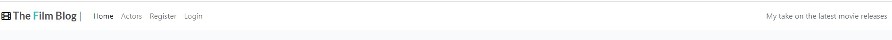
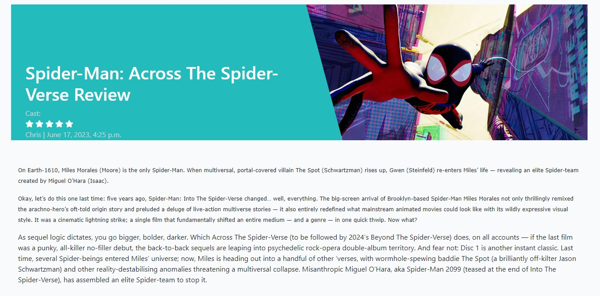
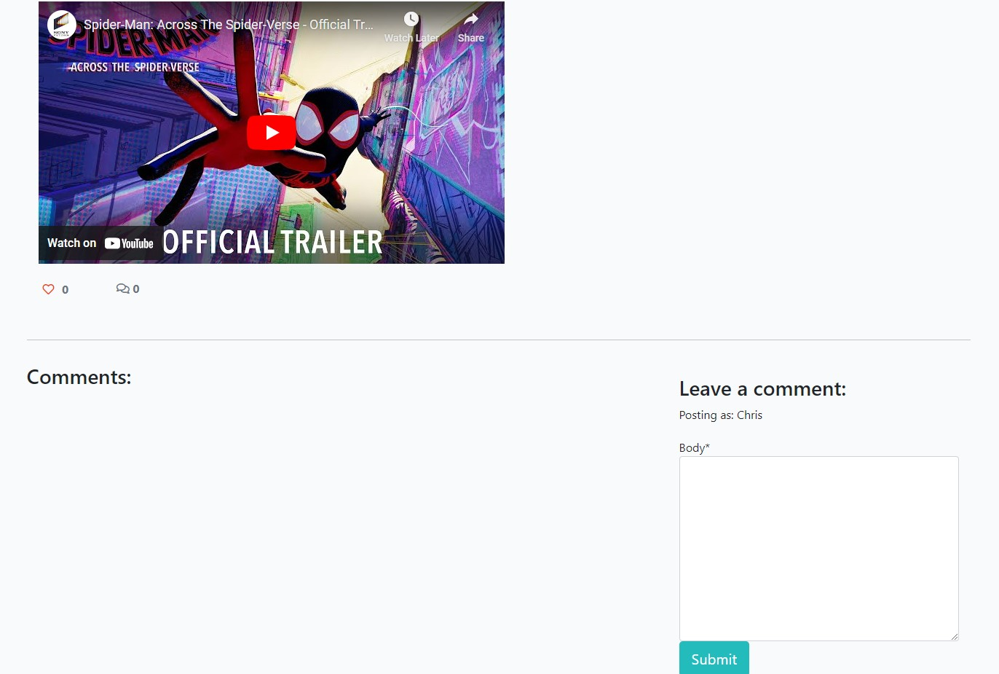

# My Film blog
This website was designed and developed as a film review blog where reviews of the latest films could be posted, with site users able to read the reviews, and registered site users able to comment and click like on the reviews. This allows users to engage with other users in a conversation on the films being reviewed.

The website has a simple layout with a homepage containing a list of the latest reviews.

The live website on Github pages can be accessed at the following link: [View my Live Website on Github Pages here](https://github.com/Christo107/MyFilmBlog)

## CONTENTS

* [Introduction](#my-film-blog)

* [Sections and Pages](#sections-and-pages)
    *  [Header](#header-and-navbar)
    *  [Film Review list](#film-review-list)
    *  [Film Review Detail](#film-review-detail)
    *  [Register Page](#register-page)
    *  [Login Page](#login-page)
    *  [Footer](#footer)
    *  [Admin](#admin)   
* [User Experience](#user-experience)
    *  [User Stories](#user-stories)
* [Design](#design)
    *  [Colour Palette](#colour-palette)
    *  [Typography](#typography)
    *  [Imagery](#imagery)
    *  [Wireframes](#wireframes)
    *  [Accessibility](#accessibility)
* [Technologies Used](#technologies-used)   
    *  [Languages Used](#languages-used)
    *  [Frameworks, Libraries and Programs Used](#frameworks-libraries-and-programs-used)
* [Testing](#testing)
    * [Validator Testing](#validator-testing)
    * [Responsiveness Testing](#responsiveness-testing)
    * [Accessibility Testing](#accessibility-testing)
    * [User Story Testing](#user-story-testing)
* [Bugs](#Bugs)
* [Deployment](#deployment)
* [Credits](#credits)
* [Acknowledgements](#acknowledgements)

## Sections and Pages

### Existing Sections
- #### **Header**
    - The header contains the name of the website along with a logo of a section of film strip.
    - Alongside this on the left of the page, a link for Home, Actors, Register and Login are also present
    - On the far-right, a tag-line description of what purpose the website serves is shown reading "My take on the latest moview release"

- #### **Film Review List**
    - This section contains the main elements of the homepage, namely a grid of the film reviews currently published on the website.
    - The Film review list is is displayed in a grid format, with 3 columns and 2 rows. The film reviews are paginated once they reach 6 on the page.
    - Each card shows an image of the film review, the title, the star rating, cast members, author of the review, date of publication, an excerpt, number of likes

- #### **Film Review Detail**
    - When a user clicks on the title or excerpt of a particular review, they are brought to the Review Detail page.
    - This page contains more information of the review including
        - Featured Image
        - Title
        - Cast
        - Star Rating
        - Author
        - Date and Time of publication
        - Review text content
        - YouTube link to trailer
        - Number of Likes
        - Number of comments
        - Comment Form (for registered users only)
        - Comments (displayed oldest to newest)

    
- #### **Footer**
    - At the bottom of the pages, there is a footer containing the developer's name and a link to the gitHub profile of the developer, in case someone wished to contact the developer or view other projects by them.

### Future Features

- #### Search Field
    - I would like to add a search function so that site users can easily find reviews of films they are interested in.

- #### Actor Reviews
    - Breakdown of reviews based on specific actors. This would show all the reviews on the website that contain a specific actor as part of the cast.

- #### Social account Registration
    - Register an account with a user's social account for ease of signup and integration.

- #### Cinema Listings
    - Link to local cinema listings where users can find out where to watch the film in the current review.

- #### Previous comments
    - Profile page information showing all previous commented reviews by a particular user.

## User Experience

### User Stories

#### Client Goals
- To have an accessible, responsive website that is easy to navigate and encourages users to engage with the content contained within.

#### User Goals
- As a User 

## Design

### Colour Palette
- 

### Typography
- 

### Imagery
- 

### Wireframes
- I designed the website firstly through hand drawn sketches that were then turned into basic wireframes on Figma, before being made into high fidelity wireframes.

- [Desktop Wireframe](./)
- [Tablet Wireframe](./)
- [Mobile Wireframe](./)
- [Desktop High Fidelity Wireframe](./media/images/)
- [Tablet High Fidelity Wireframe](./)
- [Mobile High Fidelity Wireframe](./)

### Accessibility

## Technologies used

### Languages used
- HTML5
- CSS3
- Javascript
- Python

### Frameworks, Libraries and Programs used
- [GitHub](https://github.com)
- [Gitpod](https://gitpod.io/workspaces)
- [Figma](https://www.figma.com/)
- [Optimizilla Image Compressor](https://imagecompressor.com)
- [Fontawesome](https://fontawesome.com/)
- [Am I Responsive](http://ami.responsivedesign.is/)
- [Coolers.co](https://coolors.co)
- [Chrome Dev Tools](https://www.google.com/intl/en_ie/chrome/)
- [A11y color contrast validator](https://color.a11y.com/Contrast/)
- [Favicon.io](https://favicon.io/)
- [Django]
- [Cloudinary]
- [Bootstrap]
- [Heroku]

## Testing
The website was tested for markup and CSS validation along with javascript, responsive design and accessibility using multiple browsers including Chrome, EDGE, and Firefox.
Please see screenshots of the results below:
- [W3C Markup Result]() 
- [W3C CSS Validator Result]()

### Validator Testing
- HTML
    - Before final deployment, no errors were returned when passing through the offical W3C Validator
- CSS
    - Before final deployment, no errors were found when passing through the official W3C Jigsaw CSS Validator
- Javascript
    - The javascript code was run through jshint to check for any errors. No errors were identified.
- Python
    - The python code was run through Pep8 to check for errors. It passed with no errors

### Responsiveness Testing
- The website was tested for responsiveness using the Chrome and Firefox browsers and their associated Developer Tools. 
#### Chrome
- A variety of screen sizes were checked for responsiveness using the Developer tools from 4K displays at 2560px wide, laptop sizes 1440px and 1024px, tablets at 768px, and a variety of mobile sizes down to 320px width. All elements maintained functionality and visibility in all scenarios, however, there were some issues with mobile landscape being able to fit all the componenets on the screen at the same time(see fixed bugs section below). Real world testing was also conducted on physical devices of various sizes to ensure integrity. No issue was encountered on these apart from the mobile landscape issue.
- A Lighthouse report was run several times to gauge the performance, accessibility, best practice and SEO scores. 

 - 
 - 

### Accessibility Testing
- Multiple tests were run on the website using Lighthouse and A11y Color Contrast Accessibility Validator to examine any accessibility issues. https://color.a11y.com/
#### Firefox
- Firefox's built in colour blindness simulator was used to identify any areas where sufficient colour contrast was not present. No such areas were found.

### User Story Testing

## Deployment
I used Gitpod to develop the website and the site was deployed using Heroku.

- The steps to deploy are as follows: 

The live link can be found here - https://

## Bugs
### Fixed Bugs

### Known Bugs

## Credits

### Code

### Content

- The text content of the website was taken from the Empire Film Review website here : (https://www.empireonline.com/movies/reviews/)
- The social media icons in the footer were taken from [Font Awesome](https://fontawesome.com/)

### Media

## Acknowledgements
 - The CI students who peer reviewed my website and gave feedback
