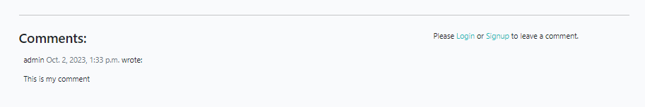

# My Film blog
This website was designed and developed as a film review blog where reviews of the latest films could be posted, with site users able to read the reviews, and registered site users able to comment and click like on the reviews. This allows users to engage with other users in a conversation on the films being reviewed.

The website has a simple layout with a homepage containing a list of the latest reviews, along with an actors biography section.

[Link to my Github Repository](https://github.com/Christo107/MyFilmBlog)

The live website on Github can be accessed at the following link: [View my Live Website on Heroku here](https://myfilmblog.herokuapp.com/)

## CONTENTS

* [Introduction](#my-film-blog)

* [Sections and Pages](#sections-and-pages)
    *  [Header](#header-and-navbar)
    *  [Film Review list](#film-review-list)
    *  [Film Review Detail](#film-review-detail)
    *  [Register Page](#register-page)
    *  [Login Page](#login-page)
    *  [Footer](#footer)
    *  [Admin](#admin)
    *  [Database Diagram](#database-diagram)
* [User Experience](#user-experience)
    *  [User Stories](#user-stories)
* [Design](#design)
    *  [Colour Palette](#colour-palette)
    *  [Typography](#typography)
    *  [Imagery](#imagery)
    *  [Wireframes](#wireframes)
    *  [Accessibility](#accessibility)
* [Technologies Used](#technologies-used)   
    *  [Languages Used](#languages-used)
    *  [Frameworks, Libraries and Programs Used](#frameworks-libraries-and-programs-used)
* [Testing](#testing)
    * [Validator Testing](#validator-testing)
    * [Responsiveness Testing](#responsiveness-testing)
    * [Accessibility Testing](#accessibility-testing)
    * [User Story Testing](#user-story-testing)
* [Bugs](#Bugs)
* [Deployment](#deployment)
* [Credits](#credits)
* [Acknowledgements](#acknowledgements)

## Sections and Pages

### Existing Sections
- #### **Header**
    - The header contains the name of the website along with a logo of a section of film strip.
    - Alongside this on the left of the page, a link for Home, Actors, Search by Genre dropdown, Register and Login are also present
    - On the far-right, a tag-line description of what purpose the website serves is shown reading "My take on the latest moview release"
    - For admin users, a hidden site admin dropdown appears where they can add a blog post and add an actor profile from the frontend rather than in the admin panel.

- #### **Film Review List**
    - This section contains the main elements of the homepage, namely a grid of the film reviews currently published on the website.
    - The Film review list is is displayed in a grid format, with 3 columns and 2 rows. The film reviews are paginated once they reach 6 on the page.
    - Each card shows an image of the film review, the title, the star rating, cast members, author of the review, date of publication, an excerpt, number of likes

- #### **Film Review Detail**
    - When a user clicks on the title or excerpt of a particular review, they are brought to the Review Detail page.
    - This page contains more information of the review including
        - Featured Image
        - Title
        - Cast
        - Star Rating
        - Author
        - Genre
        - Date and Time of publication
        - Review text content
        - YouTube link to trailer
        - Number of Likes
        - Number of comments
        - Comment Form (for registered users only)
        - Comments (displayed oldest to newest)

- #### Register Page

- #### Login Page

    
- #### **Footer**
    - At the bottom of the pages, there is a footer containing the developer's name and a link to the gitHub profile of the developer, in case someone wished to contact the developer or view other projects by them.

### Future Features

- #### Search Field
    - I would like to add a search function so that site users can easily find reviews of films they are interested in.

- #### Social account Registration
    - Register an account with a user's social account for ease of signup and integration.

- #### Cinema Listings
    - Link to local cinema listings where users can find out where to watch the film in the current review.

- #### Previous comments
    - Profile page information showing all previous commented reviews by a particular user.

### Database Diagram

## User Experience

### User Stories

#### Client Goals
- To have an accessible, responsive website that is easy to navigate and encourages users to engage with the content contained within.

#### User Goals

##### Delivered features
- As a site user I can login to my registered account so that access the comment and like functionality
- As a site user I can logout of my registered account so that I can **keep my account safe from other users
- As a Site Admin I can create, read, update and delete posts so that I can manage my blog content
- As a Site Admin I can create draft posts so that I can finish writing the content later
- As a Site Admin I can approve or disapprove comments so that I can filter out objectionable comments
- As a Site User I can view a list of posts so that I can select one to read
- As a Site User / Admin I can view the number of likes on each post so that I can see which is the most popular
- As a Site User I can view a paginated list of posts so that easily select a post to view
- As a Site User I can click on a post so that I can read the full text
- As a Site User I can register an account so that I can add posts, comment and like existing posts
- As a Site User / Admin I can view comments on an individual post so that I can read the replies to a post
- As a Site User I can leave comments on a post so that I can engage with other users
- As a Site User I can like or unlike a post so that I can interact with the content
- As a site user I can filter the reviews so that I can view only specific reviews based on certain criteria
- As a site user I can edit my comments so that I can fix mistakes or add additional content

##### Non-Delivered features
- As a Site User I can login to my profile so that I can view all my previously created posts
- As a site user I can bookmark a review so that I can revisit the post at a later date
- As a site user I can search for where the reviewed film is being shown in my local area so that I can see the film being reviewed and form my own opinion
- As a site user I can register an account using my social media accounts so that I don't have to create separate login details for the website
- As a site user I can search for specific reviews so that I can quickly find a review of a film

## Design

### Colour Palette

### Typography
- Helvetica font used for review content for readability
- Lato font used for headers and prominent titles

### Wireframes
- I designed the website firstly through hand drawn sketches that were then turned into basic wireframes on Figma.

- [Desktop Wireframe](./media/images/homepage_wireframe_dsktp.jpg)

- [Mobile Wireframe](./media/images/homepage_wireframe_mobile.jpg)

### Accessibility

## Technologies used

### Languages used
- HTML5
- CSS3
- Javascript
- Python

### Frameworks, Libraries and Programs used
- [GitHub](https://github.com)
- [Gitpod](https://gitpod.io/workspaces)
- [Figma](https://www.figma.com/)
- [Optimizilla Image Compressor](https://imagecompressor.com)
- [Fontawesome](https://fontawesome.com/)
- [Am I Responsive](http://ami.responsivedesign.is/)
- [Coolers.co](https://coolors.co)
- [Chrome Dev Tools](https://www.google.com/intl/en_ie/chrome/)
- [A11y color contrast validator](https://color.a11y.com/Contrast/)
- [Favicon.io](https://favicon.io/)
- [Django]
- [Cloudinary]
- [Bootstrap]
- [Heroku]

## Testing
The website was tested for markup and CSS validation along with javascript, responsive design and accessibility using multiple browsers including Chrome, EDGE, and Firefox.
Please see screenshots of the results below:
- [W3C Markup Result](https://validator.w3.org/nu/?doc=https%3A%2F%2Fmyfilmblog.herokuapp.com%2F) 
- [W3C CSS Validator Result](https://jigsaw.w3.org/css-validator/validator?uri=https%3A%2F%2Fmyfilmblog.herokuapp.com%2F&profile=css3svg&usermedium=all&warning=1&vextwarning=&lang=en)

### Validator Testing
- HTML
    - Before final deployment, no errors were returned when passing through the offical W3C Validator
- [W3C Validator HTML](./media/images/w3c_homepage_initial_results.jpg)
- [W3C Validator HTML](./media/images/w3c_homepage_follow_up_results.jpg)
- CSS
    - Before final deployment, no errors were found when passing through the official W3C Jigsaw CSS Validator
- [W3C Validator CSS](./media/images/w3c_homepage_css_results.jpg)
- Javascript
    - The javascript code was run through jshint to check for any errors. No errors were identified.
- Python
    - The python code was run through Pep8 to check for errors. It passed with no errors
- [PEP8 result](./media/images/pep8%20results/pep8%20linter_admin.py.jpg)
- [PEP8 result](./media/images/pep8%20results/pep8%20linter_blogurls.py.jpg)
- [PEP8 result](./media/images/pep8%20results/pep8%20linter_filmblogurls.py.jpg)
- [PEP8 result](./media/images/pep8%20results/pep8%20linter_manage.py.jpg)
- [PEP8 result](./media/images/pep8%20results/pep8%20linter_models.py.jpg)
- [PEP8 result](./media/images/pep8%20results/pep8%20linter_settings.py.jpg)
- [PEP8 result](./media/images/pep8%20results/pep8%20linter_views.py.jpg)

### Responsiveness Testing
- The website was tested for responsiveness using the Chrome and Firefox browsers and their associated Developer Tools. 
#### Chrome Developer tools
- A variety of screen sizes were checked for responsiveness using the Developer tools from 4K displays at 2560px wide, laptop sizes 1440px and 1024px, tablets at 768px, and a variety of mobile sizes down to 320px width. All elements maintained functionality and visibility in all scenarios, however, there were some issues with responsiveness on images on the actor_detail page on smaller devices.
- A Lighthouse report was run several times to gauge the performance, accessibility, best practice and SEO scores. 

#### Lighthouse Scoring

 - [Lighthouse scoring Homepage Desktop](./media/images/homepage_lighthouse_results_dsktp.jpg)
 - [Lighthouse scoring Post Detail Desktop](./media/images/post_detail_lighthouse_results_dsktp.jpg)
 - [Lighthouse scoring Actor List Desktop](./media/images/actor_list_lighthouse_results_dsktp.jpg)
 - [Lighthouse scoring Actor Detail Desktop](./media/images/actor_detail_lighthouse_results_dsktp.jpg)

### Accessibility Testing
- Multiple tests were run on the website using Lighthouse and A11y Color Contrast Accessibility Validator to examine any accessibility issues. https://color.a11y.com/
#### Firefox
- Firefox's built in colour blindness simulator was used to identify any areas where sufficient colour contrast was not present. No such areas were found.

### User Story Testing
- The delivered user stories were manually tested to ensure all acceptance criteria were met
- 
- 

## Deployment
I used Gitpod to develop the website and the site was deployed using Heroku.

- The steps to deploy are as follows:

- Login or create an account at Heroku.
- On the main page, select the 'New' button and then select 'Create New App' from the drop-down.
- Give your app a unique name and choose your relevant region e.g. Europe.
- In the 'Settings' tab of your app select 'Reveal Config Vars'.
- Add a value for 'SECRET_KEY' connecting to your django environment.
- Add a value for 'DATABASE_URL' connecting to your postgreSQL database.
- Add a value for 'ClOUDINARY_URL' connecting to cloudinary's cloud hosting service for media.
- Back at the top of the page select the 'Deploy' tab.
- Select GitHub as preferred deployment method, confirm connecting to Github if not automatic.
- Connect to your relevant repository on GitHub.

- Ensure DEBUG = False in settings.py when making final deployment

To Clone
You can clone this project by executing the following:
- Open this project on GitHub here.
- You will be provided with three options to choose from, HTTPS, SSH or GitHub CLI, click clipboard in order to copy.
- Once selected, the forked project will be in your repositories.
- Open up a new terminal.
- Adjust the current directory to be the location you wish the cloned directory to be.
- Type 'git clone' and paste the URL copied above in step 2.
- Hit 'Enter' and the project will be successfully cloned.

To Fork
- Open this project on GitHub here.
- The fork button is found at the top of the page.
- The forked project will be in your repositories.

The live link can be found here - https://myfilmblog.herokuapp.com/

## Bugs
### Fixed Bugs
- Actor_Detail page was not loading due to errors in the views and Url patterns code. This was fixed with the aid of Josh from Tutor Support.

### Known Bugs
- Responsiveness on Actor Detail card on smaller devices.

## Credits

### Code
- Main code based on Code Institute's walkthrough project "I think therefore I blog" with changes made to suit my project

### Content

- The text content of the website was taken from the Empire Film Review website here : (https://www.empireonline.com/movies/reviews/)
- The social media icons in the footer were taken from [Font Awesome](https://fontawesome.com/)

### Media
- Film images sourced from Empire movie reviews website (https://www.empireonline.com/movies/reviews/)
- Actor images sourced from Wikipedia (https://www.wikipedia.com)
- Icons sourced from Font Awesome

## Acknowledgements
 - The CI students who peer reviewed my website and gave feedback
 - Josh on Tutor support who helped me overcome a late issue in my website
 - Roman Rakic, Ulrike_5P and Martin on Tutor support who gave me invaluable help with issues I had on the project. Thanks so much.
